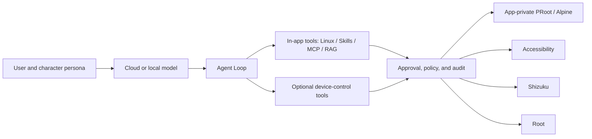

<p align="center">
  
</p>

<h1 align="center">Yachiyo Claw</h1>

<p align="center">
  An open-source Android AI chat client, device agent, and Live2D real-time interaction app
</p>

<p align="center">
  <a href="LICENSE"></a>
  
  
</p>

<p align="center">
  <a href="README.md">Chinese</a> | <strong>English</strong>
</p>

<p align="center">
  <a href="#features">Features</a> | <a href="#known-limitations">Limitations</a> | <a href="#agent-execution-model">Security model</a> | <a href="#build-locally">Build</a> | <a href="#credits-and-references">Credits</a>
</p>

Yachiyo Claw is an Android-first AI client. Building on Chatbox's multi-model conversations, it adds a device agent that runs inside the Android app, Live2D conversations, voice and camera input, character personas, on-device models and knowledge bases, Skills, MCP, shared conversations, and scheduled tasks.

It is designed for people who want to paste an API key and start using it, while offering Accessibility, Shizuku, and root execution backends for Android users who need device control.

This repository is maintained with assistance from Codex and written with assistance from GPT 5.6 Sol and Claude Fable 5.

> [!IMPORTANT]
> This project is in early preview. [GitHub Releases](https://github.com/Wayne1145/yachiyo-claw/releases) provides preview APKs signed with a NewDreamStudio development key, not an app-store production signing key. The agent can operate a real device. Test on a spare device or emulator first, and choose the approval mode appropriate for each task.

## Features

### Chat and models

- Ready-to-use Yachiyo API setup with the fixed API host `https://api.yachiyo8000.cn/v1` and server-provided model lists.
- GPT-series Yachiyo chat models combine server metadata with product-known capabilities so vision, reasoning, and tool use are presented consistently; image, embedding, and rerank models are not mislabeled as chat models.
- OpenAI-compatible Chat Completions, plus the retained Chatbox Responses API and multi-provider adaptation layer.
- A unified conversation entry point for regular chat and Agent mode, with Agent capabilities enabled or disabled in the same context.
- Local persistence for conversations, history, and model selections; conversations can be renamed, deleted, favorited, and forked, with independently scrolling long lists.
- Character cards with an avatar, Soul persona, user profile, memory, default LLM, TTS, and Live2D model.
- A dedicated local-model center that searches Hugging Face and ModelScope together, shows the exact size of the preferred runnable file or complete shard group, and provides details, formats, parameters, quantization, licenses, and RAM/storage/ABI-based compatibility estimates.
- Model files are downloaded into app-private storage with space limits, resume support, pause/resume/cancel actions, SHA-256 verification, and persistent download state.
- Local-model downloads use the centralized Download Manager in Settings. Task state, speed, ETA, downloaded/total bytes, and failure details remain available after leaving the source page or dismissing a notification, with resume, cancel, and delete controls.
- Native Android integration for LiteRT-LM and llama.cpp loads `.litertlm` and single-file or complete-shard `.gguf` chat models respectively. MediaPipe Text Embedder generates local text vectors from downloaded `.tflite` models.
- Downloaded models have a dedicated list and can be made default, loaded into memory, unloaded, or deleted. Manual preloading disables GGUF memory mapping, reads the weights into memory, and shows model size, inference-process PSS, and elapsed time. Deletion also clears native files, provider models, defaults, favorites, and stale references in model pickers.
- On an Android 12 emulator with 6 GB of RAM, continuous Gemma 3 270M GGUF chat, FunctionGemma LiteRT-LM structured tool calling, and resident model processes have been tested. Models smaller than 1B use a compact persona and request-filtered tool descriptions to protect response context.

### Local knowledge base and Vibe Coding

- Android parses PDF and DOCX locally: PDF.js extracts page text, while JSZip unpacks DOCX and reads WordprocessingML. Input size, page count, and expanded-text limits apply during parsing.
- Local RAG supports document chunking, indexing, retrieval, and persistence. With a compatible MediaPipe embedding model installed it uses vector retrieval, with lexical retrieval as a fallback when no model is configured or inference fails.
- An optional Vibe Coding environment installs an Alpine Linux mini rootfs in app-private storage and provides Bash, Git, Python, Node.js/npm, SSH, and common build tools through PRoot.
- The development-environment page supports installation, progress reporting, terminal self-checks, and reset. Agent sandbox tools access `/workspace` through structured calls with path restrictions, timeouts, and output limits.
- The Android MCP client supports protected-resource discovery, OAuth authorization code flow with PKCE, app deep-link callbacks, secure access-token and refresh-token storage, retry after refresh, and authenticated MCP requests.

> [!WARNING]
> PRoot is a userspace filesystem and process-environment compatibility layer, not a container, virtual machine, or kernel-level security boundary. Linux sandbox commands must still pass through the Yachiyo Claw Tool Broker, approval, path constraints, and audit layer. Do not treat PRoot as strong isolation for untrusted binaries.

### Android Agent

- By default, Agent mode enables only in-app tools such as the Linux sandbox, Skills, MCP, files, and retrieval. Device control is a separate switch.
- Once device control is enabled, Root, Shizuku, and Accessibility execution backends can be selected, each with its own permission guidance.
- Built-in tools observe the screen, tap, swipe, enter text, press system keys, launch apps, and read device information.
- The Agent persona and hidden run instructions are separate, so switching characters does not replace tool-use rules.
- Manual approval, AI pre-approval, and full-control modes are available. Risky operations can be allowed once or for the current session.
- Supports a selected working directory, permission guidance, cached root state, execution audits, and task cancellation.
- An edge glow, action-status capsule, and stop button appear only while the Agent is actually operating the device.
- Skills can be installed or authored and MCP servers can be connected. Script-based Skills are validated and executed in the app-private Linux sandbox, independently of device-control permission.
- Souls are stored per character. The user profile and long-term memory are shared by normal chat and Agent mode, and can be edited from main settings.
- The Skills page displays SkillHub popular results and search results directly. Android can locate and install a real `SKILL.md` directory from a repository address, GitHub URL, or `skills.sh` skill link.

### Extensions and themes

- The declarative theme center accepts pasted JSON, a selected file, or a public HTTPS import, with temporary preview, install, switch, and delete actions. Themes can override supported color tokens only and cannot run code.
- Two built-in, non-removable appearances are available: Yachiyo Light Pink and Yachiyo Liquid Glass. Liquid Glass uses a pure-white chat background and translucent navigation and input controls. Its title row remains visible, while Agent controls and input tools can be expanded or collapsed independently.
- Android includes a third-party plugin center, HTTPS or local ZIP installation, declarative pages, settings contributions, Agent-tool contributions, permission management, health state, updates, and complete uninstall.
- Script plugins run in an opaque-origin Worker without inherited app-origin permissions. They call allowlisted Host APIs through versioned JSON-only RPC; network, storage, and tool access are granted per plugin manifest, while failures are audited and can trigger timeout termination, health circuit breaking, or install rollback.
- The sample plugin's full Android path has been tested on device: local FunctionGemma tool invocation, top-level approval, isolated Worker execution, result return, and a second model response.

### Live2D real-time interaction

- A standalone Interactive page can inherit any chat context and switch between chat and Agent modes.
- Includes a Yachiyo Live2D model and supports importing ZIP model packages that contain `.model3.json`.
- Expression and motion names are read automatically; the model can trigger them from `[action]` markers as speech progresses.
- Supports streaming responses, segmented TTS, voice input, muting, lip sync, and auto-dismissed translucent dialogue bubbles.
- Supports front and rear camera previews, a draggable picture-in-picture window, and a model-invoked camera tool.
- ASR and TTS providers are configurable. The default bundled Sherpa-ONNX model provides bilingual Chinese/English streaming speech recognition without Google speech services or extra downloads, and an Edge TTS template is included.

### Android application experience

- Light pink-and-white styling, an optional ChatGPT-style Liquid Glass theme, capsule controls, page-transition motion, and portrait/landscape layouts.
- Layouts are tuned for common full-screen ratios and high-resolution devices close to 9:21. Agent and download queues have been checked for input, scrolling, and bottom-navigation boundaries at `1200x2608` and `1440x3200` portrait viewports.
- Create one-time, daily, or weekly Agent tasks manually; due tasks run when the app is active or becomes active again.
- Scheduled tasks persist and wake reliably through Room, WorkManager, and boot/app-upgrade recovery receivers; the foreground app still continues the actual model and tool execution.
- API keys, login tokens, and sensitive settings use Android Keystore-backed encrypted storage.
- The app can check this project's GitHub Releases at launch. The Android updater downloads an APK into app-private storage, validates HTTPS origin, SHA-256, package name, signing chain, and an increasing `versionCode`, then passes it to the system installer and automatically removes stale installation packages after an upgrade.
- Models, updates, Linux environments, plugin/Skill packages, remote themes, and app assets share the Download Manager in Settings, with 1-64 segments, resume support, proxy support, Wi-Fi-only mode, independent notifications, and recovery after process recreation.
- Download settings independently enable `hf-mirror.com` and `ghfast.top`. They are enabled by default when a mainland China network egress is successfully detected on first launch, and saved user choices are not overwritten. Mirrors proxy allowlisted resources only; model digests and APK digest/signature verification remain unchanged.
- Android CI includes TypeScript checks, foundation tests, native-log privacy checks, Gradle unit tests, and Debug APK builds.
- Yachiyo Claw's chat, Interactive, Agent, permissions, local models, downloads, themes, plugins, and workspace pages can be switched fully to English. User-defined names and third-party content retain their original language.

## Known limitations

- LiteRT-LM, llama.cpp, and MediaPipe download, loading, and invocation paths are connected, but system-level performance validation has not been completed across vendor SoCs and 1B-4B production weights for first-token latency, sustained generation rate, peak memory, thermal behavior, and long-session stability. Compatibility estimates are not a run guarantee.
- GGUF currently uses CPU inference and returns text after generation finishes. Local Agent tool calls depend on models reliably following a constrained structured protocol; no native token-by-token streaming tool events are available. Local embeddings are limited to MediaPipe Text Embedder-compatible `.tflite` models.
- Weights, tokenizers, configurations, and derived content in model repositories remain subject to their own licenses, access restrictions, and terms. Users confirm applicable licenses before downloading or running them; Yachiyo Claw's GPLv3 does not cover third-party model weights.
- The PRoot sandbox does not provide kernel-level isolation. Skill scripts are consistently routed into it, but complex Python or Node dependencies must still be installed and managed by each Skill or project.
- WorkManager provides persistent wakeups and recovery, but fully headless Agent inference and tool execution while the application process does not exist is not implemented.
- In-app update code and automated verification are complete, but formal same-signature upgrade, tampered-package rejection, and Android 11/13/15-16 device-matrix acceptance still need to be completed with production APKs.
- Unsigned sideloaded plugins are explicitly marked as having unverified origins and still require users to grant each capability individually. Signed marketplaces, plugin API compatibility, and broader Android System WebView testing need a larger device matrix.
- Skill updates currently only check and report a remote revision; they do not silently replace installed content. More complete device tools, long-term-memory retrieval, and MCP mobile-management experiences are still being refined.

For the development plan and acceptance criteria, see [ROADMAP](docs/ROADMAP.md). For permissions and execution boundaries, see [SECURITY_MODEL](docs/SECURITY_MODEL.md).

Usage and release material is available in [Download Manager](docs/downloads.md), [Themes](docs/themes.md), [Skills](docs/skills.md), [Plugin Developer Preview](docs/plugins/README.md), [Privacy Notice](PRIVACY.md), [Security Policy](SECURITY.md), and the [v0.0.14 release notes](docs/releases/v0.0.14.md).

## Agent execution model



Model output never directly executes Shell, Shizuku, root, or Accessibility actions. Device operations must pass through structured tools, approval policy, and native execution layers.

## Build locally

### Download and install

Download `yachiyo-claw-v*.apk` from the [latest GitHub Release](https://github.com/Wayne1145/yachiyo-claw/releases/latest), then verify it with the `.sha256` file from the same release. Android may require the current installation source to receive the Install unknown apps permission. Updating an existing installation requires the same signing key.

### Requirements

- Windows 10/11 PowerShell
- An Android 11 or newer device or emulator
- Keep Node, JDK, Android SDK, Gradle caches, and downloaded content inside this workspace

### Setup and verification

```powershell
powershell -ExecutionPolicy Bypass -File scripts/bootstrap-toolchain.ps1
powershell -ExecutionPolicy Bypass -File scripts/yachiyo-env.ps1 pnpm install
powershell -ExecutionPolicy Bypass -File scripts/yachiyo-env.ps1 pnpm check
powershell -ExecutionPolicy Bypass -File scripts/yachiyo-env.ps1 pnpm test:android-foundation
powershell -ExecutionPolicy Bypass -File scripts/yachiyo-env.ps1 pnpm run check:android-native-logs
powershell -ExecutionPolicy Bypass -File scripts/yachiyo-env.ps1 pnpm run mobile:sync:android
powershell -ExecutionPolicy Bypass -File scripts/yachiyo-env.ps1 gradle testDebugUnitTest
powershell -ExecutionPolicy Bypass -File scripts/yachiyo-env.ps1 gradle assembleDebug
```

The Debug APK is written to:

```text
android/app/build/outputs/apk/debug/app-debug.apk
```

For full environment instructions, see [BUILDING.md](docs/BUILDING.md). In a restricted network environment, set `YACHIYO_PROXY_URL`; the development scripts are compatible with `http://127.0.0.1:7890` by default.

## Credits and references

Yachiyo Claw does not merge the code of every referenced project directly. The tables below distinguish code foundations, dependencies in use, and product or architecture references; each project remains subject to its own license.

### Code foundations and core ecosystem

| Project | Use in Yachiyo Claw |
| --- | --- |
| [chatboxai/chatbox](https://github.com/chatboxai/chatbox) | Upstream code foundation for conversations, providers, message rendering, settings, and the tool framework |
| [ionic-team/capacitor](https://github.com/ionic-team/capacitor) | Bridge between Web/React and native Android capabilities |
| [vercel/ai](https://github.com/vercel/ai) | Model streaming and structured tool calls |
| [modelcontextprotocol/typescript-sdk](https://github.com/modelcontextprotocol/typescript-sdk) | MCP client and tool-protocol support |
| [guansss/pixi-live2d-display](https://github.com/guansss/pixi-live2d-display) | PixiJS Live2D rendering and model control |

### Local models, documents, and Linux environment

| Project | Use in Yachiyo Claw |
| --- | --- |
| [google-ai-edge/LiteRT-LM](https://github.com/google-ai-edge/LiteRT-LM) | Android `.litertlm` model loading and on-device chat inference |
| [ggml-org/llama.cpp](https://github.com/ggml-org/llama.cpp) | Android `.gguf` CPU inference and chat templates |
| [google-ai-edge/mediapipe](https://github.com/google-ai-edge/mediapipe) | MediaPipe Text Embedder and local `.tflite` text vectors |
| [k2-fsa/sherpa-onnx](https://github.com/k2-fsa/sherpa-onnx) | Bundled bilingual streaming offline speech recognition on Android |
| [mozilla/pdf.js](https://github.com/mozilla/pdf.js) | Local PDF text extraction in Android/WebView |
| [Stuk/jszip](https://github.com/Stuk/jszip) | Local DOCX ZIP and WordprocessingML parsing |
| [proot-me/proot](https://github.com/proot-me/proot) | Android userspace Linux filesystem and process environment |
| [termux/termux-packages](https://github.com/termux/termux-packages) | Build source for PRoot and Android runtime dependencies |
| [Alpine Linux](https://alpinelinux.org/) | Mini rootfs and apk package ecosystem downloaded at first use |
| [Hugging Face Hub](https://huggingface.co/) | Local-model search, metadata, and weight downloads |
| [ModelScope](https://modelscope.cn/) | Local-model search, metadata, and weight downloads |

### Agent, interaction, and product-design references

| Project | Reference area |
| --- | --- |
| [AAswordman/Operit](https://github.com/AAswordman/Operit) | Android Agent, permission backends, tools, and mobile task experience |
| [NousResearch/hermes-agent](https://github.com/NousResearch/hermes-agent) | Agent approval modes, Skills, memory, and self-extension workflows |
| [Open-LLM-VTuber/open-llm-vtuber](https://github.com/Open-LLM-VTuber/open-llm-vtuber) | Live2D, streaming voice, expression/action markers, and real-time interaction flows |
| [moeru-ai/airi](https://github.com/moeru-ai/airi) | Character cards, Live2D character experience, and interaction UI design |
| [google-ai-edge/gallery](https://github.com/google-ai-edge/gallery) | Android on-device models, LiteRT-LM execution, and model-management references |
| [yashab-cyber/opendroid](https://github.com/yashab-cyber/opendroid) | Android action catalog, Agent Loop, and device-automation research |

### Android privileged-capability references

| Project | Reference area |
| --- | --- |
| [RikkaApps/Shizuku](https://github.com/RikkaApps/Shizuku) | Shizuku user authorization and runtime environment |
| [RikkaApps/Shizuku-API](https://github.com/RikkaApps/Shizuku-API) | Shizuku API integration |
| [topjohnwu/libsu](https://github.com/topjohnwu/libsu) | Root Shell, RootService, and compatibility approaches for multiple root managers |
| [MuntashirAkon/libadb-android](https://github.com/MuntashirAkon/libadb-android) | On-device Android ADB capability research |

Third-party servers in the in-app recommended MCP directory come from the upstream Chatbox registry. They are not installed automatically with Yachiyo Claw. Read each repository's license, permission, and privacy information before enabling one.

## Name and asset notice

The name and visual inspiration come from Yachiyo Tsukimi in *Chao Shi Kong Hui Ye Ji*. The character avatar and Live2D model in this repository are used only to demonstrate character interaction in this open-source project. Rights to the associated character, images, and model assets remain with their respective authors and rights holders. See [NOTICE](src/renderer/public/live2d/NOTICE.md) for Live2D runtime and model notices.

Yachiyo Claw is an independent open-source project. It has no affiliation with or official partnership with the film's production companies, distributors, Netflix, Live2D Inc., or any other rights holder.

## License

This repository continues development from Chatbox Community Edition and is released under [GPL-3.0-only](LICENSE). Third-party source code, libraries, character assets, Live2D models, and model weights retain their own licenses and terms; see [THIRD_PARTY_NOTICES.md](THIRD_PARTY_NOTICES.md).

## v0.0.14

- Fixes repeated installation prompts for same-version update packages. The in-app updater now rejects downgrade and same-version APKs, and clears stale downloaded state.
- Download settings add switches for GitHub and Hugging Face mirrors. They are enabled by default when mainland China is detected on first launch, and users can still override the choice.
- GGUF "Load into memory" now performs real preloading and shows model size, process-resident memory, and load time. Normal inference can still use memory mapping to reduce peak memory use.
- Expands Android-page internationalization, adds in-app explanations for API, local-model, and network errors, and removes legacy links to Chatbox documentation.
- The Liquid Glass theme retains a fixed title row and collapses only Agent controls. Input-area tools move into a horizontally expandable secondary tray, with improved visual fallbacks for older WebViews.

See the [v0.0.14 release notes](docs/releases/v0.0.14.md) for the complete changes, limitations, and release gates.

Copyright (c) NewDreamStudio and contributors.
