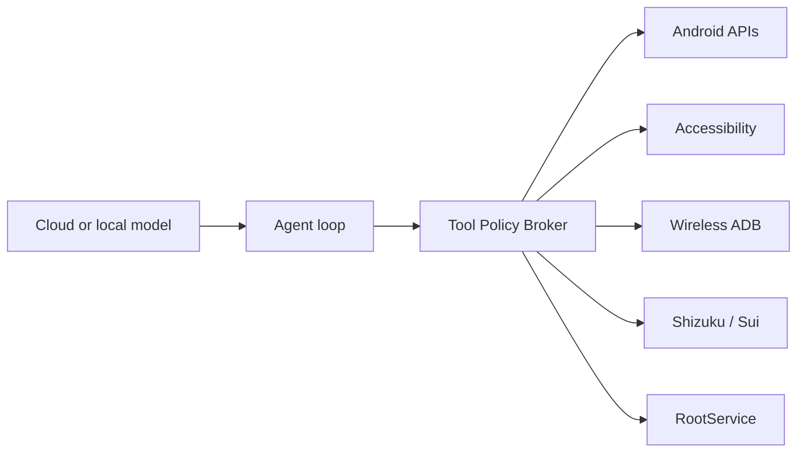

<p align="center">
  
</p>

<h1 align="center">Yachiyo Claw</h1>

[简体中文](docs/README.zh-CN.md)

Yachiyo Claw is an open-source Android AI chat client and local device agent. It combines a multi-provider chat experience with an Android-native agent runtime, optional on-device models, and explicit access to device capabilities through Accessibility, wireless ADB, Shizuku/Sui, or root.

> [!IMPORTANT]
> This project is in early development. The Android shell builds, but there is no signed public release yet. Privileged device automation and local inference are roadmap work, not finished features.

## Current Status

| Area | Status |
| --- | --- |
| Android 11+ Capacitor shell | Builds as a debug APK |
| Chatbox conversations and provider registry | Integrated from upstream |
| OpenAI Chat Completions and Responses API | Existing base retained; Android streaming/status handling hardened |
| Workspace-local reproducible toolchain | Pinned, verified and bootstrapped from the lock file |
| Android Keystore secret protection | Settings, API keys and login tokens protected; recovery flow included |
| Tool Policy Broker contracts | Versioned v1 contracts and privacy-safe audit projection implemented |
| Android CI | Type checks, focused security tests, Gradle tests, APK build and content audit |
| Accessibility / ADB / Shizuku / root backends | Planned |
| LiteRT-LM downloadable local models | Planned |
| WorkManager tasks and schedules | Planned |

See the [roadmap](docs/ROADMAP.md) for milestone definitions and acceptance gates, and the [security model](docs/SECURITY_MODEL.md) for trust boundaries and non-negotiable invariants.

## Design

The model never receives direct access to shell, ADB, Shizuku, root, Accessibility, or Android APIs. It can only request versioned, structured tools. A native policy broker validates parameters, assigns risk, asks for approval, selects the least-privileged available backend, applies timeouts, and writes an audit record.



Native JSON-Schema tools are the execution primitive. Skills compose those tools into reusable workflows. Explicitly authorized HTTP MCP servers provide third-party extensions.

## Product Goals

- Android 11 and newer on modern Snapdragon and Dimensity devices.
- API-first setup for users who only know how to paste an API key.
- OpenAI-compatible Chat Completions and Responses, plus the existing provider catalog.
- Optional on-device models up to roughly 4B parameters and 15 GB downloads.
- Screen observation, gestures, app/system/file tools, background tasks, and schedules.
- A restricted store build and a clearly differentiated full GitHub sideload build.
- Calm, modern UI with visible plan, permission, execution, and verification states.

## Build

All toolchains, caches, research sources, and development models stay inside the workspace. The default network proxy is `http://127.0.0.1:7890` and can be overridden with `YACHIYO_PROXY_URL`.

```powershell
powershell -ExecutionPolicy Bypass -File scripts/bootstrap-toolchain.ps1 -VerifyOnly
powershell -ExecutionPolicy Bypass -File scripts/yachiyo-env.ps1 doctor
powershell -ExecutionPolicy Bypass -File scripts/yachiyo-env.ps1 pnpm check
powershell -ExecutionPolicy Bypass -File scripts/yachiyo-env.ps1 pnpm test:android-foundation
powershell -ExecutionPolicy Bypass -File scripts/yachiyo-env.ps1 pnpm run mobile:sync:android
powershell -ExecutionPolicy Bypass -File scripts/yachiyo-env.ps1 gradle testDebugUnitTest --no-daemon --max-workers=1 --no-watch-fs
powershell -ExecutionPolicy Bypass -File scripts/yachiyo-env.ps1 gradle assembleDebug --no-daemon --max-workers=1 --no-watch-fs
```

Full setup, known upstream baseline failures, and APK installation are documented in [Building Yachiyo Claw](docs/BUILDING.md).

## Upstream Projects

Yachiyo Claw keeps Chatbox Git history and uses or studies several open-source projects:

- [Chatbox](https://github.com/chatboxai/chatbox): conversations, UI, provider registry, and task UI.
- [OpenDroid](https://github.com/yashab-cyber/opendroid): Android action catalog, agent-loop, and model-management reference.
- [Google AI Edge Gallery](https://github.com/google-ai-edge/gallery): LiteRT-LM, tool calling, skills, and model-management reference.
- [Shizuku API](https://github.com/RikkaApps/Shizuku-API), [libsu](https://github.com/topjohnwu/libsu), and [libadb-android](https://github.com/MuntashirAkon/libadb-android): privileged backend building blocks.

Components are selectively integrated behind Yachiyo's policy boundary. Upstream permission manifests or download code are not copied without review.

## Safety And Distribution

- API keys and privileged credentials must be protected by Android Keystore-backed encryption.
- Destructive, externally visible, account, purchase, message, and privacy-sensitive actions require parameter-level confirmation by default.
- Password fields and sensitive screen content are redacted from observations and logs.
- The project does not attempt to bypass `FLAG_SECURE`, Android confirmation screens, restricted settings, or vendor security controls.
- Autonomous Accessibility behavior is not presented as Play-policy compatible; store and sideload capabilities will differ visibly.

## Name And Independence

The name was inspired by Yachiyo Runami from *Cosmic Princess Kaguya!*. The product uses an original abstract "Lunar Operator" identity and does not use character art, costume silhouettes, voice, dialogue, music, logos, or film assets.

Yachiyo Claw is an independent open-source project. It is not affiliated with the film, its creators, Netflix, or any rights holder. The working name remains subject to a trademark review before public release.

## License

This repository is licensed under [GPL-3.0](LICENSE), consistent with the Chatbox Community Edition base. Third-party libraries and model weights retain their own licenses and terms. Release builds will include the required notices and a software bill of materials.
