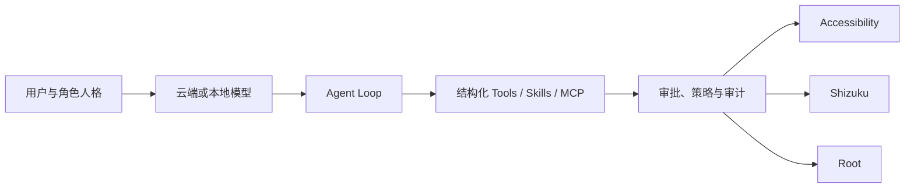

<p align="center">
  
</p>

<h1 align="center">Yachiyo Claw</h1>

<p align="center">
  面向 Android 的开源 AI 聊天、手机 Agent 与 Live2D 实时交互应用
</p>

<p align="center">
  <a href="LICENSE"></a>
  
  
</p>

Yachiyo Claw 是一个 Android 优先的 AI 客户端。它在 Chatbox 的多模型对话基础上加入了直接运行于 Android 应用中的设备 Agent、Live2D 交互式对话、语音与摄像头输入、角色人格、端侧模型与知识库、Skills、MCP、共享会话和定时任务。

项目面向希望“粘贴 API Key 后直接使用”的用户，同时为熟悉 Android 的用户提供无障碍、Shizuku 和 root 三种设备执行后端。

> [!IMPORTANT]
> 项目仍处于早期预览阶段，[GitHub Releases](https://github.com/Wayne1145/yachiyo-claw/releases) 提供使用 NewDreamStudio 开发密钥签名的预览 APK，并非应用商店正式签名版本。Agent 能够操作真实设备，请先在备用机或模拟器中测试，并根据任务选择合适的审批模式。

## 已实现功能

### 对话与模型

- Yachiyo API 开箱配置，API 主机固定为 `https://api.yachiyo8000.cn/v1`，支持服务端模型列表。
- Yachiyo API 的 GPT 系列聊天模型会合并服务端元数据与产品已知能力，统一展示视觉、推理和工具调用能力；图片、embedding 与 rerank 模型不会被误标为聊天模型。
- 支持 OpenAI-compatible Chat Completions，并保留 Chatbox 的 Responses API 与多 Provider 适配层。
- 普通聊天和 Agent 使用统一会话入口，可在同一上下文中启用或关闭 Agent 能力。
- 本地保存会话、历史记录和模型选择；会话支持删除、收藏与 Fork。
- 角色卡支持头像、Soul 人格、用户画像、记忆、默认 LLM、TTS 和 Live2D 模型。
- 独立本地模型中心可同时搜索 Hugging Face 与魔搭社区（ModelScope），按行展示模型，并提供详情、文件格式、参数、量化、许可证和基于设备 RAM/存储/ABI 的兼容性估算。
- 模型文件下载到应用私有目录，支持空间限制、断点续传、暂停/恢复/取消、SHA-256 校验和下载状态持久化。
- 本地模型页右上角提供独立下载队列；离开页面或通知消失后仍可查看任务状态、下载速度、预计剩余时间、已下载/总大小与失败原因，并可继续、取消或删除任务。
- Android 原生接入 LiteRT-LM，可加载 `.litertlm` 对话模型；接入 MediaPipe Text Embedder，可使用已下载的 `.tflite` 模型生成本地文本向量。

### 本地知识库与 Vibe Coding

- Android 可在本地解析 PDF 与 DOCX：PDF 使用 PDF.js 提取页面文字，DOCX 使用 JSZip 解包并读取 WordprocessingML；解析过程包含输入体积、页数和展开后文本上限。
- 本地 RAG 支持文档分块、索引、检索和持久化；安装兼容的 MediaPipe embedding 模型后使用向量检索，未配置或推理失败时保留词法检索回退。
- 可选的 Vibe Coding 环境在应用私有目录安装 Alpine Linux mini rootfs，并通过 PRoot 提供 Bash、Git、Python、Node.js/npm、SSH 和常用构建工具。
- 开发环境页支持安装、进度显示、终端自检和重置；Agent 的沙箱工具通过结构化调用访问 `/workspace`，带路径约束、超时和输出上限。
- Android MCP 客户端支持受保护资源发现、OAuth 授权码 + PKCE、应用深链回调、access token/refresh token 安全存储、刷新后重试和已鉴权的 MCP 请求。

> [!WARNING]
> PRoot 是用户态文件系统与进程环境兼容层，不是容器、虚拟机或内核级安全边界。Linux 沙箱中的命令仍必须经过 Yachiyo Claw 的 Tool Broker、审批、路径限制和审计；不要把 PRoot 当作可以安全运行任意不可信二进制的强隔离环境。

### Android Agent

- Root、Shizuku 和无障碍三种执行后端，可按设备条件切换。
- 内置屏幕观察、点击、滑动、文字输入、系统按键、应用启动和设备信息读取工具。
- Agent 人格与隐藏运行指令分离，切换角色不会覆盖工具使用规则。
- 支持手动审批、AI 预审和完全控制模式；危险操作可单次允许或在当前会话中允许。
- 支持自选工作目录、权限向导、Root 状态缓存、执行审计与取消任务。
- 仅在 Agent 真正操作设备时显示屏幕边缘光效、操作状态胶囊和停止按钮。
- 支持安装/编写 Skills、连接 MCP Server，以及独立的 Soul、User、Memory 编辑。
- Skills 页面直接展示 SkillHub 热门列表与搜索结果；Android 可从仓库地址、GitHub URL 或 `skills.sh` 技能链接定位并安装真实的 `SKILL.md` 目录。

### Live2D 实时交互

- 独立“交互式”页面，可继承任意聊天上下文并切换聊天或 Agent 模式。
- 内置八千代 Live2D 模型，并支持导入包含 `.model3.json` 的 ZIP 模型包。
- 自动读取模型的表情与动作名称，模型可通过 `[action]` 标记按语音进度触发表情和动作。
- 支持流式回答、分段 TTS、语音输入、静音、嘴型同步和自动消失的半透明对话气泡。
- 支持前后摄像头预览、拖动小窗和由模型主动调用的拍照工具。
- ASR/TTS Provider 可配置；默认内置 Sherpa-ONNX 中英双语流式识别模型，不依赖设备的 Google 语音服务或额外下载，并提供 Edge TTS 模板。

### Android 应用体验

- 浅色粉白主题、胶囊控件、页面过渡动画以及竖屏/横屏布局。
- 针对常见全面屏比例和接近 9:21 的高分辨率设备进行布局适配；Agent 与下载队列已在 `1200x2608`、`1440x3200` 竖屏视口检查输入区、滚动区和底部导航边界。
- 手动创建一次、每日或每周 Agent 任务；应用运行或重新激活时执行到期任务。
- 定时任务通过 Room、WorkManager 和开机/应用升级恢复接收器持久化并可靠唤醒；当前仍由前台应用接续实际模型与工具执行。
- API Key、登录令牌及敏感设置使用 Android Keystore 支持的加密存储。
- 可在启动时检查本项目的 GitHub Release；Android 更新器将 APK 下载到应用私有缓存，验证 HTTPS 来源、SHA-256 与包名后交给系统安装器，并支持未知来源安装权限引导。
- Android CI 包含 TypeScript 检查、基础测试、原生日志隐私检查、Gradle 单测和 Debug APK 构建。

## 尚未完成与已知边界

- LiteRT-LM 与 MediaPipe 的下载、加载和调用链路已经接通，但尚未对不同厂商 SoC、1B-4B 真实权重的首 token 延迟、持续生成速度、内存峰值、温升和长会话稳定性完成系统性能验证；兼容性估算不等同于运行保证。
- 当前本地对话运行时仅面向 LiteRT-LM 支持的 `.litertlm` 模型，本地 embedding 仅面向 MediaPipe Text Embedder 兼容的 `.tflite` 模型；模型中心展示的其他格式不代表可以直接运行。
- 模型仓库中的权重、Tokenizer、配置和衍生内容继续受各自许可证、访问限制及使用条款约束。下载或运行前由用户确认相关许可证，Yachiyo Claw 的 GPLv3 不会覆盖第三方模型权重。
- PRoot 沙箱尚未提供内核级隔离；Python/Node Skills 的依赖环境与该沙箱的统一生命周期管理仍需继续完善。
- WorkManager 已提供持久化唤醒和恢复，但应用进程不存在时的完整无界面 Agent 推理与工具执行尚未实现。
- 应用内更新代码和自动化验证已完成，仍需用正式同签名 APK 完成从已发布版本升级、拒绝篡改包以及 Android 11/13/15-16 设备矩阵验收。
- 更完整的设备工具、长期记忆检索、Skill 市场和 MCP 移动端管理体验仍在继续完善。

开发计划与验收条件见 [ROADMAP](docs/ROADMAP.md)，权限和执行边界见 [SECURITY_MODEL](docs/SECURITY_MODEL.md)。

## Agent 执行结构



模型输出不会直接执行 Shell、Shizuku、root 或无障碍动作。设备操作必须经过结构化工具、审批策略和原生执行层。

## 本地构建

### 下载与安装

从 [最新 GitHub Release](https://github.com/Wayne1145/yachiyo-claw/releases/latest) 下载 `yachiyo-claw-v*.apk`，并使用同一 Release 中的 `.sha256` 文件核对完整性。Android 可能要求为当前安装来源授予“安装未知应用”权限；从旧版覆盖安装时必须保持签名一致。

### 要求

- Windows 10/11 PowerShell
- Android 11 或更高版本的设备/模拟器
- 所有 Node、JDK、Android SDK、Gradle 缓存和下载内容均保存在本工作区

### 初始化与验证

```powershell
powershell -ExecutionPolicy Bypass -File scripts/bootstrap-toolchain.ps1
powershell -ExecutionPolicy Bypass -File scripts/yachiyo-env.ps1 pnpm install
powershell -ExecutionPolicy Bypass -File scripts/yachiyo-env.ps1 pnpm check
powershell -ExecutionPolicy Bypass -File scripts/yachiyo-env.ps1 pnpm test:android-foundation
powershell -ExecutionPolicy Bypass -File scripts/yachiyo-env.ps1 pnpm run check:android-native-logs
powershell -ExecutionPolicy Bypass -File scripts/yachiyo-env.ps1 pnpm run mobile:sync:android
powershell -ExecutionPolicy Bypass -File scripts/yachiyo-env.ps1 gradle testDebugUnitTest
powershell -ExecutionPolicy Bypass -File scripts/yachiyo-env.ps1 gradle assembleDebug
```

构建产物位于：

```text
android/app/build/outputs/apk/debug/app-debug.apk
```

更完整的环境说明见 [BUILDING.md](docs/BUILDING.md)。网络受限时可设置 `YACHIYO_PROXY_URL`，开发脚本默认兼容 `http://127.0.0.1:7890`。

## 引用与致谢

Yachiyo Claw 没有把所有参考项目的代码直接合并进来。下表区分了代码基础、已使用依赖与产品/架构参考；各项目继续遵循各自许可证。

### 代码基础与核心生态

| 项目                                                                                          | 本项目中的用途                                         |
| --------------------------------------------------------------------------------------------- | ------------------------------------------------------ |
| [chatboxai/chatbox](https://github.com/chatboxai/chatbox)                                     | 上游代码基础：会话、Provider、消息渲染、设置与工具框架 |
| [ionic-team/capacitor](https://github.com/ionic-team/capacitor)                               | Web/React 与 Android 原生能力桥接                      |
| [vercel/ai](https://github.com/vercel/ai)                                                     | 模型流式输出与结构化工具调用                           |
| [modelcontextprotocol/typescript-sdk](https://github.com/modelcontextprotocol/typescript-sdk) | MCP 客户端和工具协议支持                               |
| [guansss/pixi-live2d-display](https://github.com/guansss/pixi-live2d-display)                 | PixiJS Live2D 渲染与模型控制                           |

### 本地模型、文档与 Linux 环境

| 项目                                                                    | 本项目中的用途                                    |
| ----------------------------------------------------------------------- | ------------------------------------------------- |
| [google-ai-edge/LiteRT-LM](https://github.com/google-ai-edge/LiteRT-LM) | Android `.litertlm` 模型加载与端侧对话推理        |
| [google-ai-edge/mediapipe](https://github.com/google-ai-edge/mediapipe) | MediaPipe Text Embedder 与本地 `.tflite` 文本向量 |
| [k2-fsa/sherpa-onnx](https://github.com/k2-fsa/sherpa-onnx)             | Android 端内置中英双语流式离线语音识别            |
| [mozilla/pdf.js](https://github.com/mozilla/pdf.js)                     | Android/WebView 内本地 PDF 文字解析               |
| [Stuk/jszip](https://github.com/Stuk/jszip)                             | DOCX ZIP/WordprocessingML 本地解析                |
| [proot-me/proot](https://github.com/proot-me/proot)                     | Android 用户态 Linux 文件系统与进程环境           |
| [termux/termux-packages](https://github.com/termux/termux-packages)     | PRoot 及 Android 运行时依赖的构建来源             |
| [Alpine Linux](https://alpinelinux.org/)                                | 首次使用时下载的 mini rootfs 与 apk 软件包生态    |
| [Hugging Face Hub](https://huggingface.co/)                             | 本地模型搜索、元数据和权重下载来源                |
| [ModelScope / 魔搭社区](https://modelscope.cn/)                         | 本地模型搜索、元数据和权重下载来源                |

### Agent、交互与产品设计参考

| 项目                                                                                  | 参考内容                                       |
| ------------------------------------------------------------------------------------- | ---------------------------------------------- |
| [AAswordman/Operit](https://github.com/AAswordman/Operit)                             | Android Agent、权限后端、工具与移动端任务体验  |
| [NousResearch/hermes-agent](https://github.com/NousResearch/hermes-agent)             | Agent 审批模式、Skills、记忆与自我扩展工作流   |
| [Open-LLM-VTuber/open-llm-vtuber](https://github.com/Open-LLM-VTuber/open-llm-vtuber) | Live2D、流式语音、表情动作标记和实时交互流程   |
| [moeru-ai/airi](https://github.com/moeru-ai/airi)                                     | 角色卡、Live2D 角色体验和交互界面设计          |
| [google-ai-edge/gallery](https://github.com/google-ai-edge/gallery)                   | Android 端侧模型、LiteRT-LM 运行和模型管理参考 |
| [yashab-cyber/opendroid](https://github.com/yashab-cyber/opendroid)                   | Android 动作目录、Agent Loop 与设备自动化调研  |

### Android 高权限能力参考

| 项目                                                                            | 参考内容                                         |
| ------------------------------------------------------------------------------- | ------------------------------------------------ |
| [RikkaApps/Shizuku](https://github.com/RikkaApps/Shizuku)                       | Shizuku 用户端授权与运行环境                     |
| [RikkaApps/Shizuku-API](https://github.com/RikkaApps/Shizuku-API)               | Shizuku API 接入方式                             |
| [topjohnwu/libsu](https://github.com/topjohnwu/libsu)                           | Root Shell、RootService 与多 Root 管理器兼容思路 |
| [MuntashirAkon/libadb-android](https://github.com/MuntashirAkon/libadb-android) | Android 设备内 ADB 能力调研                      |

应用内 MCP 推荐目录中的第三方 Server 来自 Chatbox 上游注册表，它们不会随 Yachiyo Claw 自动安装；实际启用时请分别阅读对应仓库的许可证、权限和隐私说明。

## 名称与素材说明

名称和视觉灵感来自《超时空辉夜姬》中的月见八千代。仓库中的角色头像和 Live2D 模型仅用于本开源项目的角色交互演示，相关角色、图像和模型素材的权利归其各自作者与权利方所有。Live2D 运行库及模型说明见 [NOTICE](src/renderer/public/live2d/NOTICE.md)。

Yachiyo Claw 是独立的开源项目，与影片制作方、发行方、Netflix、Live2D Inc. 或其他权利方不存在隶属或官方合作关系。

## License

本仓库基于 Chatbox Community Edition 继续开发，并以 [GPL-3.0](LICENSE) 发布。第三方源码、库、角色素材、Live2D 模型和模型权重保留各自许可证与使用条款。

Copyright (c) NewDreamStudio and contributors.
