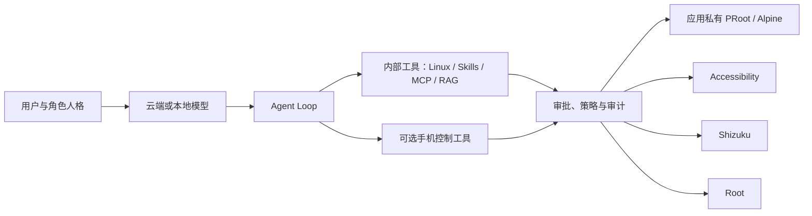

<p align="center">
  
</p>

<h1 align="center">Yachiyo Claw</h1>

<p align="center">
  面向 Android 的开源 AI 聊天、手机 Agent 与 Live2D 实时交互应用
</p>

<p align="center">
  <a href="LICENSE"></a>
  
  
</p>

<p align="center">
  <strong>简体中文</strong> | <a href="README.en.md">English</a>
</p>

<p align="center">
  <a href="#已实现功能">功能</a> | <a href="#尚未完成与已知边界">已知边界</a> | <a href="#agent-执行结构">执行结构</a> | <a href="#本地构建">本地构建</a> | <a href="#引用与致谢">致谢</a>
</p>

Yachiyo Claw 是一个 Android 优先的 AI 客户端。它在 Chatbox 的多模型对话基础上加入了直接运行于 Android 应用中的设备 Agent、Live2D 交互式对话、语音与摄像头输入、角色人格、端侧模型与知识库、Skills、MCP、共享会话和定时任务。

项目面向希望“粘贴 API Key 后直接使用”的用户，同时为熟悉 Android 的用户提供无障碍、Shizuku 和 root 三种设备执行后端。
本仓库由 Codex 辅助管理，由 GPT 5.6 Sol 和 Claude Fable 5 辅助编写。
> [!IMPORTANT]
> 项目仍处于早期预览阶段，[GitHub Releases](https://github.com/Wayne1145/yachiyo-claw/releases) 提供使用 NewDreamStudio 开发密钥签名的预览 APK，并非应用商店正式签名版本。Agent 能够操作真实设备，请先在备用机或模拟器中测试，并根据任务选择合适的审批模式。

## 已实现功能

### 对话与模型

- Yachiyo API 开箱配置，API 主机固定为 `https://api.yachiyo8000.cn/v1`，支持服务端模型列表。
- Yachiyo API 的 GPT 系列聊天模型会合并服务端元数据与产品已知能力，统一展示视觉、推理和工具调用能力；图片、embedding 与 rerank 模型不会被误标为聊天模型。
- 支持 OpenAI-compatible Chat Completions，并保留 Chatbox 的 Responses API 与多 Provider 适配层。
- 普通聊天和 Agent 使用统一会话入口，可在同一上下文中启用或关闭 Agent 能力。
- 本地保存会话、历史记录和模型选择；会话支持重命名、删除、收藏与 Fork，长列表可独立滚动。
- 角色卡支持头像、Soul 人格、用户画像、记忆、默认 LLM、TTS 和 Live2D 模型。
- 独立本地模型中心可同时搜索 Hugging Face 与魔搭社区（ModelScope），按行展示首选可运行文件或完整分片组的精确下载大小，并提供详情、文件格式、参数、量化、许可证和基于设备 RAM/存储/ABI 的兼容性估算。
- 模型文件下载到应用私有目录，支持空间限制、断点续传、暂停/恢复/取消、SHA-256 校验和下载状态持久化。
- 本地模型页的下载入口统一跳转到设置中的下载管理；离开来源页面或通知消失后仍可查看任务状态、下载速度、预计剩余时间、已下载/总大小与失败原因，并可继续、取消或删除任务。
- Android 原生接入 LiteRT-LM 与 llama.cpp，可分别加载 `.litertlm` 和单文件/完整分片的 `.gguf` 对话模型；接入 MediaPipe Text Embedder，可使用已下载的 `.tflite` 模型生成本地文本向量。
- 本地对话模型支持 `auto`/`extreme` 性能模式与 CPU/GPU/NPU 后端覆盖。首次优化会在隔离进程中实测 TTFT、prefill/decode tokens/s 和内存，缓存最快的成功配置；GGUF 使用 Vulkan 分层卸载并保留 CPU 回退，运行页展示实际后端、卸载层数和回退原因。
- 公开 GPLv3 构建只保证通用 CPU/Vulkan 路径。NPU 仅在模型产物、SoC 清单、ABI、dispatch 与经许可厂商运行库全部匹配的专用构建中进入候选，并同时下载通用回退产物。
- 已下载模型提供独立列表、设为默认、加载进内存、卸载和删除操作；手动预加载会关闭 GGUF mmap、真实读取权重，并显示模型大小、推理进程 PSS 与耗时；删除会同步清理原生文件、Provider 模型、默认项、收藏和各模型选择器中的失效引用。
- 已在 Android 12、6 GB 模拟器上实机验证 Gemma 3 270M GGUF 连续对话、FunctionGemma LiteRT-LM 结构化工具调用及模型进程驻留；小于 1B 的模型会使用紧凑人格和按请求筛选的工具描述，避免上下文挤占回复。

### 本地知识库与 Vibe Coding

- Android 可在本地解析 PDF 与 DOCX：PDF 使用 PDF.js 提取页面文字，DOCX 使用 JSZip 解包并读取 WordprocessingML；解析过程包含输入体积、页数和展开后文本上限。
- 本地 RAG 支持文档分块、索引、检索和持久化；安装兼容的 MediaPipe embedding 模型后使用向量检索，未配置或推理失败时保留词法检索回退。
- 可选的 Vibe Coding 环境在应用私有目录安装 Alpine Linux mini rootfs，并通过 PRoot 提供 Bash、Git、Python、Node.js/npm、SSH 和常用构建工具。
- 开发环境页支持安装、进度显示、终端自检和重置；Agent 的沙箱工具通过结构化调用访问 `/workspace`，带路径约束、超时和输出上限。
- Android 底部导航的“开发”入口复用现有 Task/Provider：Web、PWA 与 Capacitor Debug APK 可在兼容手机上本地构建和验证，Kotlin APK 为 Beta；React Native、Flutter 与 NDK 仅支持源码编辑。
- Windows、macOS、iOS、Linux x86_64 与 Docker 目标需要远程 Runner。未配置 Runner 时只会显示“源码已准备”，不会生成或报告虚假的本地构建产物。
- 模型生成的文件修改先保存为带基线哈希的 ChangeSet，用户可按文件查看 Diff、应用或拒绝；APK 只从目标 Profile 声明的路径收集，并在系统安装器确认前显示包名、签名、权限与 SHA-256。
- Android MCP 客户端支持受保护资源发现、OAuth 授权码 + PKCE、应用深链回调、access token/refresh token 安全存储、刷新后重试和已鉴权的 MCP 请求。

> [!WARNING]
> PRoot 是用户态文件系统与进程环境兼容层，不是容器、虚拟机或内核级安全边界。Linux 沙箱中的命令仍必须经过 Yachiyo Claw 的 Tool Broker、审批、路径限制和审计；不要把 PRoot 当作可以安全运行任意不可信二进制的强隔离环境。

手机端目标矩阵、恢复语义和 APK 交付限制见 [移动端 Vibe Coding](docs/MOBILE_VIBE_CODING.md)。

### Android Agent

- Agent 默认只启用 Linux 沙箱、Skills、MCP、文件与检索等应用内部工具；手机控制是独立开关。
- 开启手机控制后可在 Root、Shizuku 和无障碍三种执行后端间切换，并显示独立权限指引。
- 内置屏幕观察、点击、滑动、文字输入、系统按键、应用启动和设备信息读取工具。
- Agent 人格与隐藏运行指令分离，切换角色不会覆盖工具使用规则。
- 支持手动审批、AI 预审和完全控制模式；危险操作可单次允许或在当前会话中允许。
- 支持自选工作目录、权限向导、Root 状态缓存、执行审计与取消任务。
- 仅在 Agent 真正操作设备时显示屏幕边缘光效、操作状态胶囊和停止按钮。
- 支持安装/编写 Skills、连接 MCP Server；脚本型 Skill 在应用私有 Linux 沙箱中校验并执行，不依赖手机控制权限。
- Soul 按角色保存；用户画像与长期记忆由普通聊天和 Agent 共享，并可从主设置页直接编辑。
- Skills 页面直接展示 SkillHub 热门列表与搜索结果；Android 可从仓库地址、GitHub URL 或 `skills.sh` 技能链接定位并安装真实的 `SKILL.md` 目录。

### 扩展与主题

- 声明式主题中心支持粘贴 JSON、选择文件或公开 HTTPS 导入，可临时预览、安装、切换和删除；主题只能覆盖受支持的颜色 token，不能运行代码。
- 提供不可删除的“Yachiyo 浅粉”和“Yachiyo 液态玻璃”两套内置外观；液态玻璃主题使用纯白聊天背景、半透明导航和输入控件，标题行始终保留，Agent 控制与输入工具可独立展开或收起。
- Android 已开放第三方插件中心、HTTPS/本地 ZIP 安装、声明式页面、设置贡献、Agent 工具贡献、权限管理、健康状态、更新和完整卸载。
- 脚本插件运行在不继承应用源站权限的 opaque-origin Worker 中，通过带版本的纯 JSON RPC 调用白名单 Host API；网络、存储、工具等能力按插件摘要绑定授权，运行失败会记录审计并触发超时终止、健康熔断或安装回滚。
- 已在 Android 实机验证示例插件从本地 FunctionGemma 工具调用、最上层审批、隔离 Worker 执行到结果回填和第二轮模型回答的完整链路。

### Live2D 实时交互

- 独立“交互式”页面，可继承任意聊天上下文并切换聊天或 Agent 模式。
- 内置八千代 Live2D 模型，并支持导入包含 `.model3.json` 的 ZIP 模型包。
- 自动读取模型的表情与动作名称，模型可通过 `[action]` 标记按语音进度触发表情和动作。
- 支持流式回答、分段 TTS、语音输入、静音、嘴型同步和自动消失的半透明对话气泡。
- 支持前后摄像头预览、拖动小窗和由模型主动调用的拍照工具。
- ASR/TTS Provider 可配置；默认内置 Sherpa-ONNX 中英双语流式识别模型，不依赖设备的 Google 语音服务或额外下载，并提供 Edge TTS 模板。

### Android 应用体验

- 浅色粉白主题、可选 ChatGPT 式液态玻璃主题、胶囊控件、页面过渡动画以及竖屏/横屏布局。
- 针对常见全面屏比例和接近 9:21 的高分辨率设备进行布局适配；Agent 与下载队列已在 `1200x2608`、`1440x3200` 竖屏视口检查输入区、滚动区和底部导航边界。
- 手动创建一次、每日或每周 Agent 任务；应用运行或重新激活时执行到期任务。
- 定时任务通过 Room、WorkManager 和开机/应用升级恢复接收器持久化并可靠唤醒；当前仍由前台应用接续实际模型与工具执行。
- API Key、登录令牌及敏感设置使用 Android Keystore 支持的加密存储。
- 可在启动时检查本项目的 GitHub Release；Android 更新器将 APK 下载到应用私有目录，验证 HTTPS 来源、SHA-256、包名、签名链和递增的 `versionCode` 后交给系统安装器，并在升级后自动清理陈旧安装包。
- 模型、更新、Linux 环境、插件/Skills 包体、远程主题和应用资源共用设置中的下载管理，支持 1-64 个分段、断点续传、代理、仅 Wi-Fi、独立通知和进程重建后的调度恢复。
- 下载设置可分别启用 `hf-mirror.com` 与 `ghfast.top`；首次成功识别到中国大陆网络出口时默认开启，用户随后保存的选择不会被自动覆盖。镜像只代理白名单资源，模型摘要与 APK 摘要/签名校验保持不变。
- Android CI 包含 TypeScript 检查、基础测试、原生日志隐私检查、Gradle 单测和 Debug APK 构建。
- Yachiyo Claw 自定义的聊天、交互式、Agent、权限、本地模型、下载、主题、插件和工作区页面支持完整英文切换；用户自定义名称和第三方内容保持原文。

## 尚未完成与已知边界

- LiteRT-LM、llama.cpp 与 MediaPipe 的下载、加载和调用链路已经接通，但尚未对不同厂商 SoC、1B-4B 真实权重的首 token 延迟、持续生成速度、内存峰值、温升和长会话稳定性完成系统性能验证；兼容性估算不等同于运行保证。
- GGUF 已支持 CPU 与 Vulkan 分层卸载，但仍在生成完成后一次性返回文本；本地 Agent 工具调用依赖模型稳定遵循受限结构化协议，尚未提供逐 token 原生流式工具事件。本地 embedding 仍仅面向 MediaPipe Text Embedder 兼容的 `.tflite` 模型。
- 模型仓库中的权重、Tokenizer、配置和衍生内容继续受各自许可证、访问限制及使用条款约束。下载或运行前由用户确认相关许可证，Yachiyo Claw 的 GPLv3 不会覆盖第三方模型权重。
- PRoot 沙箱尚未提供内核级隔离；Skill 脚本已统一进入该沙箱，但复杂 Python/Node 依赖仍由具体 Skill 或项目自行安装和管理。
- WorkManager 已提供持久化唤醒和恢复，但应用进程不存在时的完整无界面 Agent 推理与工具执行尚未实现。
- 应用内更新已通过正式签名连续性、版本递增和 Android 12 覆盖安装校验；Android 11/13/15-16 设备矩阵仍需继续补测。
- 未签名的本地侧载插件会明确标记来源不可验证，并仍需用户逐项授予能力；签名市场、插件 API 兼容性和更多 Android System WebView 版本仍需扩大实机矩阵。
- Skill 更新目前只检查远端 revision 并提示，不会静默替换安装内容；更完整的设备工具、长期记忆检索和 MCP 移动端管理体验仍在继续完善。

开发计划与验收条件见 [ROADMAP](docs/ROADMAP.md)，权限和执行边界见 [SECURITY_MODEL](docs/SECURITY_MODEL.md)。
使用与发布资料见 [统一下载管理](docs/downloads.md)、[主题](docs/themes.md)、[Skills](docs/skills.md)、
[插件开发者预览](docs/plugins/README.md)、[隐私说明](PRIVACY.md)、[安全政策](SECURITY.md) 和
[v0.0.16 发布说明](docs/releases/v0.0.16.md)。

## Agent 执行结构


```mermaid
flowchart LR
    USER["用户与角色人格"] --> MODEL["云端或本地模型"]
    MODEL --> LOOP["Agent Loop"]
    LOOP --> INTERNAL["内部工具：Linux / Skills / MCP / RAG"]
    LOOP --> PHONE["可选手机控制工具"]
    INTERNAL --> BROKER["审批、策略与审计"]
    PHONE --> BROKER
    BROKER --> SANDBOX["应用私有 PRoot / Alpine"]
    BROKER --> ACCESS["Accessibility"]
    BROKER --> SHIZUKU["Shizuku"]
    BROKER --> ROOT["Root"]
```

模型输出不会直接执行 Shell、Shizuku、root 或无障碍动作。设备操作必须经过结构化工具、审批策略和原生执行层。

## 本地构建

### 下载与安装

从 [最新 GitHub Release](https://github.com/Wayne1145/yachiyo-claw/releases/latest) 下载 `yachiyo-claw-v*.apk`，并使用同一 Release 中的 `.sha256` 文件核对完整性。Android 可能要求为当前安装来源授予“安装未知应用”权限；从旧版覆盖安装时必须保持签名一致。

### 要求

- Windows 10/11 PowerShell
- Android 11 或更高版本的设备/模拟器
- 所有 Node、JDK、Android SDK、Gradle 缓存和下载内容均保存在本工作区

### 初始化与验证

```powershell
powershell -ExecutionPolicy Bypass -File scripts/bootstrap-toolchain.ps1
powershell -ExecutionPolicy Bypass -File scripts/yachiyo-env.ps1 pnpm install
powershell -ExecutionPolicy Bypass -File scripts/yachiyo-env.ps1 pnpm check
powershell -ExecutionPolicy Bypass -File scripts/yachiyo-env.ps1 pnpm test:android-foundation
powershell -ExecutionPolicy Bypass -File scripts/yachiyo-env.ps1 pnpm run check:android-native-logs
powershell -ExecutionPolicy Bypass -File scripts/yachiyo-env.ps1 pnpm run mobile:sync:android
powershell -ExecutionPolicy Bypass -File scripts/yachiyo-env.ps1 gradle testDebugUnitTest
powershell -ExecutionPolicy Bypass -File scripts/yachiyo-env.ps1 gradle assembleDebug
```

构建产物位于：

```text
android/app/build/outputs/apk/debug/app-debug.apk
```

更完整的环境说明见 [BUILDING.md](docs/BUILDING.md)。网络受限时可设置 `YACHIYO_PROXY_URL`，开发脚本默认兼容 `http://127.0.0.1:7890`。

## 引用与致谢

Yachiyo Claw 没有把所有参考项目的代码直接合并进来。下表区分了代码基础、已使用依赖与产品/架构参考；各项目继续遵循各自许可证。

### 代码基础与核心生态

| 项目                                                                                          | 本项目中的用途                                         |
| --------------------------------------------------------------------------------------------- | ------------------------------------------------------ |
| [chatboxai/chatbox](https://github.com/chatboxai/chatbox)                                     | 上游代码基础：会话、Provider、消息渲染、设置与工具框架 |
| [ionic-team/capacitor](https://github.com/ionic-team/capacitor)                               | Web/React 与 Android 原生能力桥接                      |
| [vercel/ai](https://github.com/vercel/ai)                                                     | 模型流式输出与结构化工具调用                           |
| [modelcontextprotocol/typescript-sdk](https://github.com/modelcontextprotocol/typescript-sdk) | MCP 客户端和工具协议支持                               |
| [guansss/pixi-live2d-display](https://github.com/guansss/pixi-live2d-display)                 | PixiJS Live2D 渲染与模型控制                           |

### 本地模型、文档与 Linux 环境

| 项目                                                                    | 本项目中的用途                                    |
| ----------------------------------------------------------------------- | ------------------------------------------------- |
| [google-ai-edge/LiteRT-LM](https://github.com/google-ai-edge/LiteRT-LM) | Android `.litertlm` 模型加载与端侧对话推理        |
| [ggml-org/llama.cpp](https://github.com/ggml-org/llama.cpp)             | Android `.gguf` 模型 CPU/Vulkan 推理与聊天模板     |
| [KhronosGroup/Vulkan-Headers](https://github.com/KhronosGroup/Vulkan-Headers) | 可复现构建 llama.cpp Android Vulkan 后端所需的 C++ 头文件 |
| [google-ai-edge/mediapipe](https://github.com/google-ai-edge/mediapipe) | MediaPipe Text Embedder 与本地 `.tflite` 文本向量 |
| [k2-fsa/sherpa-onnx](https://github.com/k2-fsa/sherpa-onnx)             | Android 端内置中英双语流式离线语音识别            |
| [mozilla/pdf.js](https://github.com/mozilla/pdf.js)                     | Android/WebView 内本地 PDF 文字解析               |
| [Stuk/jszip](https://github.com/Stuk/jszip)                             | DOCX ZIP/WordprocessingML 本地解析                |
| [proot-me/proot](https://github.com/proot-me/proot)                     | Android 用户态 Linux 文件系统与进程环境           |
| [termux/termux-packages](https://github.com/termux/termux-packages)     | PRoot 及 Android 运行时依赖的构建来源             |
| [Alpine Linux](https://alpinelinux.org/)                                | 首次使用时下载的 mini rootfs 与 apk 软件包生态    |
| [Hugging Face Hub](https://huggingface.co/)                             | 本地模型搜索、元数据和权重下载来源                |
| [ModelScope / 魔搭社区](https://modelscope.cn/)                         | 本地模型搜索、元数据和权重下载来源                |

### Agent、交互与产品设计参考

| 项目                                                                                  | 参考内容                                       |
| ------------------------------------------------------------------------------------- | ---------------------------------------------- |
| [AAswordman/Operit](https://github.com/AAswordman/Operit)                             | Android Agent、权限后端、工具与移动端任务体验  |
| [NousResearch/hermes-agent](https://github.com/NousResearch/hermes-agent)             | Agent 审批模式、Skills、记忆与自我扩展工作流   |
| [Open-LLM-VTuber/open-llm-vtuber](https://github.com/Open-LLM-VTuber/open-llm-vtuber) | Live2D、流式语音、表情动作标记和实时交互流程   |
| [moeru-ai/airi](https://github.com/moeru-ai/airi)                                     | 角色卡、Live2D 角色体验和交互界面设计          |
| [google-ai-edge/gallery](https://github.com/google-ai-edge/gallery)                   | Android 端侧模型、LiteRT-LM 运行和模型管理参考 |
| [yashab-cyber/opendroid](https://github.com/yashab-cyber/opendroid)                   | Android 动作目录、Agent Loop 与设备自动化调研  |

### Android 高权限能力参考

| 项目                                                                            | 参考内容                                         |
| ------------------------------------------------------------------------------- | ------------------------------------------------ |
| [RikkaApps/Shizuku](https://github.com/RikkaApps/Shizuku)                       | Shizuku 用户端授权与运行环境                     |
| [RikkaApps/Shizuku-API](https://github.com/RikkaApps/Shizuku-API)               | Shizuku API 接入方式                             |
| [topjohnwu/libsu](https://github.com/topjohnwu/libsu)                           | Root Shell、RootService 与多 Root 管理器兼容思路 |
| [MuntashirAkon/libadb-android](https://github.com/MuntashirAkon/libadb-android) | Android 设备内 ADB 能力调研                      |

应用内 MCP 推荐目录中的第三方 Server 来自 Chatbox 上游注册表，它们不会随 Yachiyo Claw 自动安装；实际启用时请分别阅读对应仓库的许可证、权限和隐私说明。

## 名称与素材说明

名称和视觉灵感来自《超时空辉夜姬》中的月见八千代。仓库中的角色头像和 Live2D 模型仅用于本开源项目的角色交互演示，相关角色、图像和模型素材的权利归其各自作者与权利方所有。Live2D 运行库及模型说明见 [NOTICE](src/renderer/public/live2d/NOTICE.md)。

Yachiyo Claw 是独立的开源项目，与影片制作方、发行方、Netflix、Live2D Inc. 或其他权利方不存在隶属或官方合作关系。

## License

本仓库基于 Chatbox Community Edition 继续开发，并以 [GPL-3.0-only](LICENSE) 发布。第三方源码、库、角色素材、Live2D 模型和模型权重保留各自许可证与使用条款，详见 [THIRD_PARTY_NOTICES.md](THIRD_PARTY_NOTICES.md)。

## v0.0.16

- 重构 Android 对话输入区、模型选择器和主页面滑动切换，补充自适应操作密度并修复 React 最大更新深度崩溃。
- 新增手机端 Vibe Coding V1：项目向导、ChangeSet Diff 审批、持久构建任务、受控 Git、Web 预览和 APK 交付。
- 本地模型加入 `auto`/`extreme` 性能优化、GGUF Vulkan 分层卸载、LiteRT CPU/GPU/NPU 候选探测、实测基准和温控/内存回退。
- 增强统一下载通知、Live2D 错误诊断与 WebGL 恢复、插件市场地址和插件页面生命周期管理。
- 正式版审计修复版本号不一致、首次类型检查缺少路由表、误恢复的 Agent 硬预算，以及不可移植的 Gradle daemon/Foojay 配置。

完整变化、边界和发布门禁见 [v0.0.16 发布说明](docs/releases/v0.0.16.md)。

Copyright (c) NewDreamStudio and contributors.
