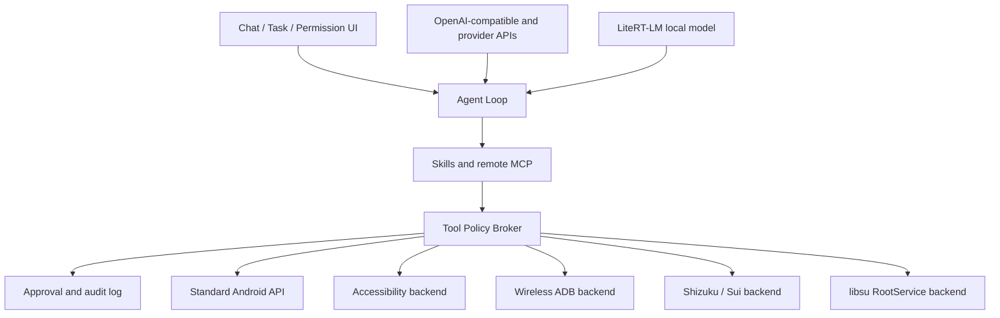

# Yachiyo Claw 路线图

Yachiyo Claw 是 Android 11+ 的开源 AI 聊天与设备 Agent。项目以 Chatbox 的会话、Provider 和任务界面为基础，增加直接运行在 Android 进程中的 Agent、设备工具、权限后端和可选本地模型。项目采用 GPL-3.0，与 Chatbox 上游许可证保持一致。

## 已选上游

| 项目 | 用途 | 接入方式 | 许可证与约束 |
| --- | --- | --- | --- |
| [Chatbox](https://github.com/chatboxai/chatbox) | UI、会话、Provider Registry、任务界面 | 保留 Git 历史并持续同步上游 | GPL-3.0，本仓库的许可证基础 |
| [OpenDroid](https://github.com/yashab-cyber/opendroid) | Agent Loop、Android 动作目录、本地模型下载思路 | 选择性移植并重写安全边界 | Apache-2.0；不复用其过宽权限清单 |
| [Google AI Edge Gallery](https://github.com/google-ai-edge/gallery) | LiteRT-LM、工具调用、Skills、模型管理 | 选择性移植并补齐下载校验 | Apache-2.0；模型权重另受模型条款约束 |
| [Shizuku API](https://github.com/RikkaApps/Shizuku-API) | Shizuku 与 Sui UserService | Maven 依赖和结构化 AIDL Bridge | MIT；不复用 Shizuku 名称、图标或 app id |
| [libsu](https://github.com/topjohnwu/libsu) | RootService、root shell 和文件访问 | Maven 依赖，封装在 RootBackend | Apache-2.0 |
| [libadb-android](https://github.com/MuntashirAkon/libadb-android) | Android 11+ 无线 ADB 配对、TLS、mDNS、shell | 选择 Apache-2.0 许可路径并保留 NOTICE | Apache-2.0/GPL-3.0-or-later 双许可；SPAKE2 组件需单独审计 |

OpenDroid 和 AI Edge Gallery 是能力捐赠者，不作为可以直接合并的应用壳层。Yachiyo Claw 只移植已经审计、能够通过本项目策略层的部分。

## 目标架构

模型永远不能直接执行 shell、ADB、Shizuku、root 或无障碍动作。模型只能请求带版本的结构化工具；`ToolPolicyBroker` 负责参数校验、风险分级、用户确认、最低权限后端选择、超时、结果裁剪和审计。

## 内置工具首批范围

- 屏幕：读取无障碍节点树、截图、点击、长按、滑动、输入文本、返回、主页和最近任务。
- 应用：列出、搜索、启动和打开应用设置；安装与卸载始终属于高风险动作。
- 系统：读取设备、电池、网络和权限状态；修改设置按具体参数审批。
- 文件：在用户授权目录中读取、写入、移动和搜索；越过 Storage Access Framework 需要特权后端。
- 网络：HTTP 请求、页面正文提取和下载；域名、重定向、大小和文件哈希受策略限制。
- 自动化：任务计划、周期任务、通知和可恢复步骤。
- 扩展：内置 Skill 组合上述工具；第三方扩展优先使用显式授权的 HTTP MCP。

## 验证分层

- 每次代码变更先运行最小相关测试；Android 阶段合并门禁固定为类型检查、`test:android-foundation`、移动 bundle 同步、Gradle 单元测试、APK 构建与包内容审计。
- Chatbox 上游全量测试和 Web 构建作为共享层兼容性门禁。已确认的上游基线失败必须记录精确用例、原因和跟踪项，不能写成“通过”或混入 Android 回归统计。
- 涉及 UI、Keystore、深链、后台、权限或设备工具的阶段还必须通过 Android 11、13 和 15/16 的模拟器或真机 smoke/instrumentation 测试；没有连接设备时只能标记为主机构建通过。
- 发布门禁在上述检查之外加入 release 签名、升级安装、权限 allowlist、遥测/调试产物扫描、SBOM 和设备矩阵报告。

## 实施阶段

### M0 可复现基线

- 固定工作区内 Node、pnpm、JDK 21、Android SDK 和 Gradle 缓存。
- 记录未修改 Chatbox 上游的类型检查、测试和 Web 构建基线。
- 所有下载、缓存、研究仓库和模型都留在工作区目录。

验收：`doctor` 输出仅指向工作区工具链，上游失败有单独记录。

### M1 Android 应用壳层

- 恢复 Capacitor Android 工程，应用名 `Yachiyo Claw`，最低 API 30。
- 建立 `debug`、完整侧载版和受限商店版的构建基础。
- 接通现有 SQLite、网络流、文件、分享、深链和 SplashScreen 插件。

验收：移动端 Web bundle、Gradle 单元测试和 `assembleDebug` 全部通过；APK 能安装并启动。

### M2 品牌与新手引导

- 应用 Lunar Operator 视觉系统、明暗主题、自适应图标和减少动态效果。
- 首次启动只要求粘贴 API Key、选择服务或填写兼容端点，并执行连通性测试。
- 权限中心渐进展示无障碍、Shizuku、ADB 和 root，不在首次启动索取高权限。

验收：小屏、常规屏和平板截图审查，无文本溢出或控件遮挡；关键流程有 UI 测试。

### M3 Provider 与 Responses API

- 保留 Chatbox 的全类型 Provider Registry。
- 将自有服务作为一等 `Yachiyo API` Provider：内置 base URL、默认模型、鉴权头和协议能力；发布配置未确定前不在源码中猜测或硬编码凭据。
- 将 OpenAI-compatible 适配拆分为 Chat Completions 与 Responses 两条经过测试的协议路径。
- 支持流式文本、结构化输出、工具调用、图像输入、错误归一化和能力探测。
- API Key 使用 Android Keystore 包装的密钥加密，不写日志或明文备份。

验收：契约测试覆盖自有 Provider、OpenAI-compatible、自定义 base URL、Chat Completions 和 Responses；为 Registry 中每个现有 Provider 维护能力矩阵和无凭据 fixture/smoke 测试，有测试账号的 Provider 再运行受保护的端到端测试。

### M4 Agent Kernel 与 Tool Broker

- 实现可暂停、取消、恢复的 Agent Loop 和步骤存储。
- 定义版本化工具协议、风险等级、参数级审批、审计记录和最小权限路由。
- 将 `callId` 持久化为幂等键，以递增 `attempt`、执行租约和 side-effect checkpoint 区分恢复与重复执行。
- 审计上下文包含 build flavor、Broker/策略版本与摘要、重试次数和后台授权 ID；模型只接收有敏感级别、字节上限和保留期的裁剪结果。
- 实现只读模拟模式，让用户在执行前查看计划和预计权限。

验收：单元测试证明模型输出无法绕过 Broker、审批摘要不匹配会被拒绝；分别在副作用之前、之后和终态落盘之前杀死进程，均能安全恢复、验证或停止且不重复副作用。

### M5 标准权限与无障碍

- 首先实现 StandardBackend 和 AccessibilityBackend。
- 屏幕观察组合节点树与截图；密码节点、通知内容和敏感应用默认脱敏。
- 无障碍配置声明窗口内容、手势和截图能力，并针对 Android 13+ 受限设置给出引导。

验收：在 Android 11、13、15/16 设备或模拟器执行一套跨应用任务；每一步均可见、可取消、可审计。

### M6 ADB、Shizuku 与 root

- 无线 ADB 支持 Android 11+ 配对码、mDNS、TLS 和密钥轮换。
- Shizuku UserService 与 libsu RootService 共享 `PrivilegedBridgeService` AIDL 契约。
- 后端只暴露结构化能力，不把任意 shell 直接交给模型；高级用户手动 shell 处于独立界面。

验收：同一工具契约分别通过 ADB、Shizuku 和 root 后端运行；断连、拒绝和超时均有测试。

### M7 本地模型

- 接入 LiteRT-LM，提供兼容设备检测、模型清单、空间/RAM 预估、断点下载与 SHA-256 校验。
- 提供经过维护的内置清单和 Hugging Face 模型读取/下载；固定仓库 revision 与文件摘要，gated model token 进入 Keystore，并在下载前展示模型许可证及必要确认。
- 首批支持适合手机的约 1B、2B 和 4B 指令/工具调用模型，单个下载上限 15 GB。
- 本地与云端模型共用 Agent 工具协议；低能力模型默认提高审批等级。

验收：模型下载可暂停恢复且拒绝 revision 或哈希不匹配文件；在 Snapdragon 与 Dimensity 代表设备、多个 RAM 档位记录 CPU/GPU/NPU 可用性与回退、峰值磁盘/RAM、首 token、tokens/s、温控降频和 OOM；离线完成聊天和一条受控工具链。

### M8 后台与定时任务

- WorkManager 负责可延期任务、下载和恢复；周期任务遵守至少 15 分钟限制。
- 待交互审批在应用进入后台时作废；无人值守步骤必须持有绑定任务、计划、工具版本、参数摘要、过期时间、次数和锁屏策略的独立后台授权。
- 只有用户明确要求精确时间时才申请 exact alarm。
- 长 Agent 会话使用带常驻通知和取消入口的前台服务；开机只重建计划。

验收：重启、杀进程、断网、低电量和权限撤销场景下不会静默执行或丢失审计状态。

### M9 安全、发布与开源治理

- 建立威胁模型、依赖/许可证清单、SBOM、静态检查和发布签名流程。
- 对 HTTP MCP 建立凭据、TLS、重定向、SSRF/DNS rebinding、loopback/LAN 目标和 capability manifest 的独立策略与测试。
- 提供权限受限的商店构建和完整的 GitHub 侧载构建；两者能力差异在 UI 中明确显示。
- 发布前完成包名、GitHub 组织、商标与隐私政策确认。

验收：可复现 release 构建、升级测试、最小权限审计和公开安全响应流程全部通过。

## 当前非目标

- iOS 适配。
- Termux、proot 或 Linux 虚拟机作为运行时。
- 绕过 `FLAG_SECURE`、系统确认页或厂商安全限制。
- 默认无人确认执行转账、购买、发送私密内容、删除数据或修改账号安全设置。

## 尚待固定的发布信息

- Android `applicationId` 暂定为 `io.github.yachiyoclaw`。
- GitHub 组织/仓库最终地址。
- 首次公开测试采用仅 GitHub APK，还是同时准备商店受限版。
- 公开发布签名密钥的保管与轮换负责人。
